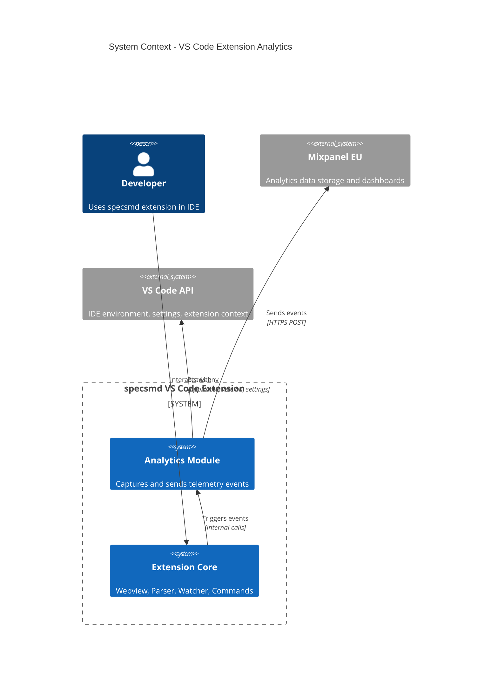

# VS Code Extension Analytics - System Context

## System Overview

The Analytics Module is an internal subsystem of the specsmd VS Code extension that captures anonymous usage telemetry and sends it to Mixpanel. It operates entirely within the extension's runtime, with no user-facing UI (except optional telemetry settings). The module must be completely isolated so that any failures do not affect extension functionality.

## Context Diagram

## Actors

| Actor | Type | Description |
|-------|------|-------------|
| Developer | Human | Uses the specsmd extension; their actions generate events |
| Extension Core | System | Parser, Webview, Watcher - triggers analytics events |
| VS Code API | System | Provides IDE detection, settings, extension context |
| Mixpanel | External | Receives and stores analytics events |

## External Integrations

| System | Purpose | Direction | Protocol | Risk |
|--------|---------|-----------|----------|------|
| **Mixpanel EU** | Analytics storage and dashboards | Outbound | HTTPS REST | Low (fire-and-forget) |
| **VS Code API** | IDE detection, settings, globalState | Inbound | Extension API | None |

## Data Flows

### Inbound (from VS Code API)
| Data | Source | Purpose |
|------|--------|---------|
| `vscode.env.appName` | VS Code | IDE name detection |
| `vscode.env.appHost` | VS Code | Host environment (desktop/web) |
| `vscode.version` | VS Code | IDE version |
| `vscode.env.language` | VS Code | User locale |
| `context.globalState` | VS Code | First-activation detection |
| `workspace.getConfiguration()` | VS Code | Telemetry opt-out setting |
| `process.env` | Node.js | DO_NOT_TRACK, SPECSMD_TELEMETRY_DISABLED |

### Outbound (to Mixpanel)
| Data | Destination | Format | Sensitivity |
|------|-------------|--------|-------------|
| Event name | Mixpanel | String | None |
| Base properties (ide_name, platform, version) | Mixpanel | JSON | Low (no PII) |
| Event-specific properties | Mixpanel | JSON | Low (no PII) |
| Machine ID hash | Mixpanel | SHA-256 | Anonymized |

### NOT Sent (Privacy)
- File paths
- Project names
- User content
- Stack traces with user code
- IP addresses (Mixpanel infers, but not stored long-term)

## System Boundaries

### In Scope
- Analytics tracker singleton
- Machine ID generation (SHA-256 hash)
- Session ID generation (UUID per activation)
- IDE detection logic
- Privacy controls (opt-out checking)
- All event tracking methods
- Error wrapping (try-catch isolation)
- Rate limiting for project events

### Out of Scope
- User-facing analytics dashboard (use Mixpanel)
- Event queuing or retry logic
- Offline event storage
- Analytics settings UI (use VS Code settings)
- A/B testing framework

## High-Level Constraints

| Constraint | Rationale |
|------------|-----------|
| Must use same Mixpanel project as npx installer | Unified analytics dashboard |
| Must use Mixpanel EU endpoint | GDPR compliance |
| Must never throw errors to extension | Extension stability paramount |
| Must work without network | Graceful degradation |
| Must not block extension activation | Performance requirement |
| TypeScript only | Match extension codebase |

## Key NFR Goals

| Category | Goal |
|----------|------|
| **Reliability** | 0% of analytics failures propagate to extension |
| **Performance** | < 50ms activation overhead |
| **Privacy** | No PII, multiple opt-out mechanisms |
| **Compatibility** | Works in VS Code, Cursor, Windsurf, VSCodium |

## Integration Points with Extension Core

| Component | Integration | Events Triggered |
|-----------|-------------|------------------|
| `extension.ts` | Activation hook | `extension_activated`, `project_snapshot` |
| `WelcomeViewProvider` | Message handlers | `welcome_*` events |
| `SpecsmdWebviewProvider` | Message handlers | `tab_changed`, `bolt_action`, `artifact_opened` |
| `FileWatcher` | Scan completion | `project_changed` |
| All components | Error boundaries | `extension_error` |
